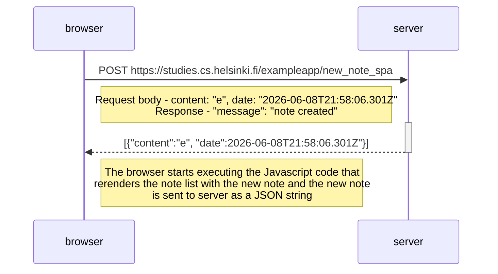

```mermaid
sequenceDiagram
    participant browser
    participant server

    browser->>server: POST https://studies.cs.helsinki.fi/exampleapp/new_note_spa
    
    Note right of browser: Request body - content: "e", date: "2026-06-08T21:58:06.301Z"<br>Response - "message": "note created"
    
    activate server
    server-->>browser: [{"content":"e", "date":2026-06-08T21:58:06.301Z"}]
    deactivate server
        
    Note right of browser: The browser starts executing the Javascript code that <br>rerenders the note list with the new note and the new note<br> is sent to server as a JSON string
```